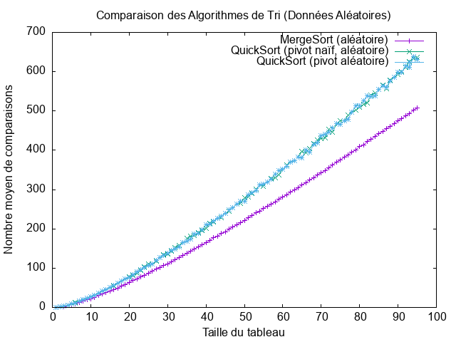
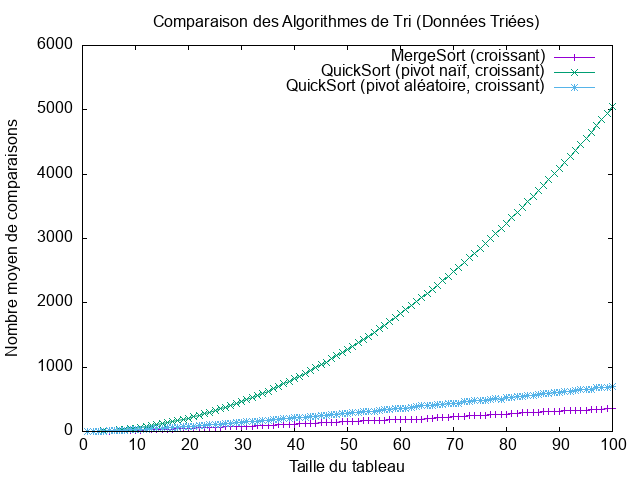
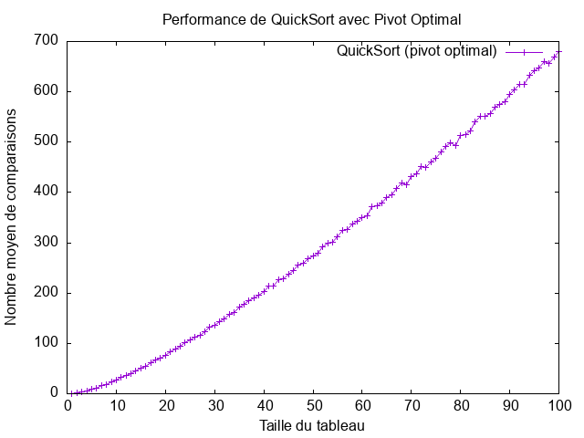

# TP tri rapide


## État du TP

Décrivez ici l'état d'avancement du TP.

## Réponses aux questions

Indiquez ici les réponses aux questions posées dans le TP. Vous
reprendrez le numéro de la section et le numéro de la question. Par
exemple pour répondre à la question 3 de la section 2.4 vous indiquerez :

### À propos des tableaux NumPy

Après avoir lancer **l'interpréteur Python** avec la commande `python3`, j'ai pu me familiariser avec les tableaux **NumPy**, avec les instructions suivantes:

```python
>>> import numpy as np
>>> tab = np.array([i for i in range(10)])
>>> tab
array([0, 1, 2, 3, 4, 5, 6, 7, 8, 9])
>>> tab[0]
0
>>> tab[-1]
9
>>> len(tab)
10
>>> for i in tab:
...     print(i)
... 
0
1
2
3
4
5
6
7
8
9
```

### Rappels sur le tri rapide

#### Q1:

Parmi les algorithmes de tris qui opte une approche de tri sur place, on a:

- Tri à bulles.
- Tri par insertion.
- Tri par sélection.
- Tri par tas.

#### Q2:

Pour partitionner un tableau sans avoir à utiliser de l'espace mémoire supplémentaire, il faut faire des **échanges** d'éléments.

#### Q3:

Afin de déterminer que le partitionnement est correctement réalisé, il faut que:

- La longueur des deux partitions soit égale à celle du tableau initial passé en paramètre.

- Le premier élément `(le pivot)` du deuxième tableau partitionné soit **strictement supérieur** à tous ceux du première tableau, mais aussi **inférieur ou égal** aux éléments du second tableau.

#### Q4:

Après avoir tester nos exemples implémentés dans la **doctest** de la fonction `partition`, avec la commande 
```bash
python3 sorting.py
```
On constate que tous les tests ont réussi avec succès.

#### Q9:

Le tri rapide est un algorithme récursif, donc la mémoire supplémentaire utilisée est due à la pile des appels récursifs, ainsi que le nombre de ces appels récursifs est influencé par le choix du pivot.

##### La complexité asymptotique en espace dans le meilleur des cas **(log n)**:
Dans le meilleur des cas, le **pivot** est au milieu du tableau, donc à chaque étape, le tableau est divisé en deux moitiés,

Ce qui nous donne une **complexité asymptotique en espace** de:

```math
O(log n)
```

##### La complexité asymptotique en espace dans le pire des cas **(n)**:
Dans le pire des cas, le **pivot** est toujours le plus petit ou le plus grand élément, car dans ce cas à chaque étape de résursion, on ne tri qu'un seul élement du tableau, donc chaque appel ne réduit la taille du tableau que d’un seul élément.

Ce qui nous donne une **complexité asymptotique en espace** de:

```math
n
```
### Sélection du pivot

##### Pivot aléatoire

#### Q3:
Après avoir modifier la fonction main de `test.py`, pour afficher le nombre de comparaisons effectuées par le **tri fusion** et le **tri rapide**, j'ai eu comme résultat:

```bash
[0 1 2 3 4 5 6 7 8 9 10 11 12 13 14 15 16 17 18 19 20 21 22 23 24 25 26 27
 28 29]
Yes !!
Nombre de comparaison du tri fusion:  114
Yes !!
Nombre de comparaison du tri rapide:  123
```

#### Q4:
L'analyse des comparaisons effectuées par **MergeSort**, **QuickSort avec pivot naïf** et **QuickSort avec pivot aléatoire** pour des tailles de tableau de 1 à 100 montre les tendances suivantes :

1️- MergeSort:

- Suit une complexité O(n log n), avec une croissance progressive et stable du nombre de comparaisons, ce qui le rend prévisible et efficace, même dans le pire des cas.

2️- QuickSort avec pivot naïf:

- Effectue beaucoup plus de comparaisons que les autres versions, en raison de cas défavorables fréquents.

3️- QuickSort avec pivot aléatoire:

- Réduit efficacement le pire cas en équilibrant mieux les partitions.
- Son nombre de comparaisons est plus proche de O(n log n), le rendant beaucoup plus efficace que le pivot naïf.

#### Q5:

L'intérêt du **tri rapide** par rapport au **tri fusion** est que il est généralement plus rapide, surtout avec un pivot bien choisi, ainsi qu'il est plus efficace en termes de mémoire que le tri fusion.

#### Q7:

Le pire cas se produit lorsque le pivot est toujours l'élément le plus grand ou le plus petit du tableau.

Si on choisit toujours le premier élément comme pivot `(pivot naïf)` et que le tableau est déjà trié, le tri rapide va toujours partitionner de manière déséquilibrée :

- Un sous-tableau contient n-1 éléments.
- L'autre sous-tableau est vide.

**Exemple:**
Si on prend un tableau `[1, 2, 3, 4, 5]`, et que le premier élément est toujours choisi comme pivot, la partition va produire :

```bash
Pivot = 1 → [] | [2, 3, 4, 5]
Pivot = 2 → [] | [3, 4, 5]
Pivot = 3 → [] | [4, 5]
...

```

**Equation de recurrence:**

```math
T ( n ) = T ( n − 1 ) + n
```
**Complexité du Pire Cas:**

La complexité dans le pire des cas en temps est représenté comme suit:

- Chaque partition prend **O(n)** comparaisons.

- Chaque appel récursif traite presque toute la liste, ce qui nous donne une profondeur de récursion **O(n)**.

Donc, **O(n) * O(n) = O(n²)**

Donc la complexité dans le pire des cas en temps est :

```math
O ( n² )
```

##### Pivot optimal

#### Q1:

Théoriquement la meilleure valeur à choisir pour le pivot est la médiane du tableau parce qu'il garantit que chaque partition divise le tableau en deux moitiés égales, ce qui réduit la profondeur de récursion à **O(log n)**, ce qui donne une complexité de **O(n log n)** dans tous les cas.

#### Q4:

**Courbe qui rerésente le nombre moyen de comparaisons du tri fusion, tri rapide avec naïve pivot et tri rapide avec pivot aléatoire d'un tableau de contenu aléatoire:**



**Courbe qui rerésente le nombre moyen de comparaisons du tri fusion, tri rapide avec naïve pivot et tri rapide avec pivot aléatoire d'un tableau de contenu croissant:**



**Courbe qui rerésente le nombre moyen de comparaisons du tri rapide avec pivot optimal d'un tableau de contenu aléatoire:**



**Courbe qui rerésente le nombre moyen de comparaisons du tri fusion, tri rapide avec naïve pivot et tri rapide avec pivot aléatoire d'un tableau de contenu aléatoire, tableau de contenu croissant, tri rapide avec pivot optimal d'un tableau de contenu aléatoire:**


Après analyse des courbes, on peut constater que le **tri fusion** est le plus efficaces en terme de nombre de comparaisons peut importe le contenu du tableau à trié `(aléatoire, croissant)`, en deuxième position on trouve le **tri rapide avec pivot optimal**, et c'est à cause du fais que le pivot est toujours au milieu du tableau ce qui cause une découpe du tableau sur deux tableau ce qui nous donne une pile de recursion de **`(log n)`**, en troixième position on trouve le **tri rapide avec pivot aléatoire**, et en dernière position on trouve le **tri rapide avec naïve pivot** surtout quand le contenu du tableau est croissant ou bien décroissant parce comme le pivot est toujours en première position, si le tableau est croisant le pivot sera toujours petit par rapport à tout les autres élements du tableau et s'il est décroissant le pivot sera toujours plus grand par rapport à tout les autres élements du tableau ce qui causera le fait dans chaque appels récursifs, on va trié qu'un seul élement ce qui nous fera une compléxité de **`O ( n² )`**

#### Q5:

**Équation de récurrence du tri rapide avec pivot optimal:**

```bash
T ( n ) = 2 T ( n / 2 ) + n
```
**La complexité en temps dans le meilleur des cas:**

La complexité en temps dans le meilleur des cas est:

```bash
O ( n log n )
```
### Pivot réellement optimal ?

#### Q1:

Le **tri rapide avec choix du pivot optimal** n'est pas toujours meilleur, parce qui'il nécessite une certain un calcul supplémentaire pour déterminer le pivot, donc parfois un peut dire que le **tri rapide avec pivot aléatoire** est plus efficace parce qu'il ne nécessite aucun calcul supplémentaire pour déterminer le pivot.
